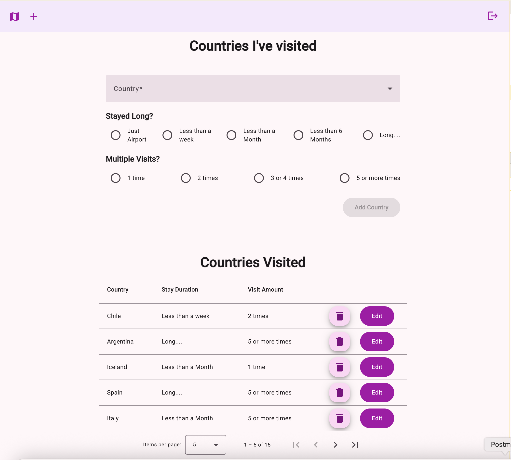
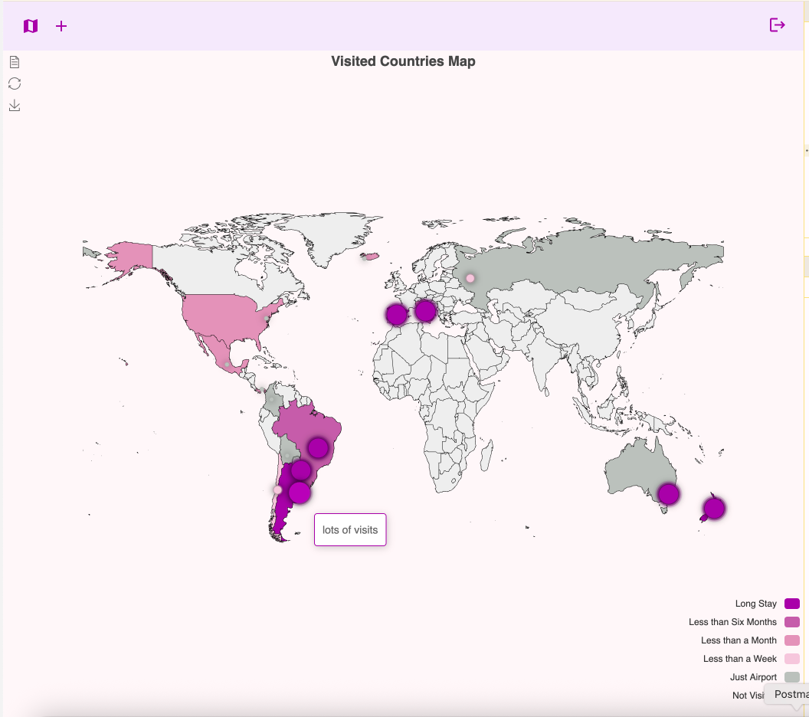

# Countries I've Travelled

To practice reactiveforms in Angular

## Overview


### Form



### Map 




## Development server

To start a local development server, run:

```bash
ng serve
```

Once the server is running, open your browser and navigate to `http://localhost:4200/`. The application will automatically reload whenever you modify any of the source files.

```bash
json-server --watch db/db.json --port 3000
```

this will create these endpoints from [`db.json`](./db/db.json) file
```
[1] http://localhost:3000/countries
[1] http://localhost:3000/users
```
OR

* To run everything using concurrently use
``` 
npm run start-all
```

* Login information

```bash
email: a@a.com
password: 1234
```

added to test auth-guard and permissions on the router